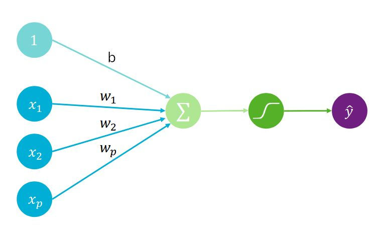
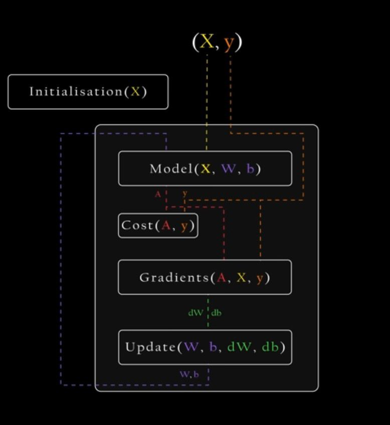
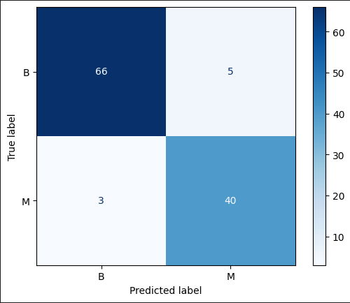

# Perceptron from Scratch — Détection du cancer du sein

Implémentation d'un perceptron (régression logistique) **from scratch**, en Python avec uniquement NumPy (sans scikit-learn pour la partie modélisation), appliqué à la prédiction de la malignité d'une tumeur à partir du dataset *Breast Cancer Wisconsin*.



## 🎯 Objectif

Comprendre et implémenter manuellement les fondations mathématiques d'un modèle de classification binaire — la brique de base des réseaux de neurones — avant d'aborder des architectures plus complexes (MLP, etc.).

## 🧠 Méthodologie

Le pipeline suit les étapes suivantes :

1. **Score linéaire** : calcul d'une combinaison linéaire des variables explicatives
   `z = w·x + b`

2. **Fonction sigmoïde** : transformation du score en probabilité
   `p = 1 / (1 + e^(-z))`

3. **Fonction de coût (log loss)** : mesure de l'écart entre les probabilités prédites et les classes réelles
   `L = -1/n Σ [yᵢ·log(pᵢ) + (1-yᵢ)·log(1-pᵢ)]`

4. **Descente de gradient** : optimisation itérative des paramètres `w` et `b` pour minimiser la log loss

5. **Seuil de décision** : classification finale en comparant la probabilité prédite à un seuil (par défaut 0.5)

Le pipeline complet d'entraînement (initialisation, forward pass, calcul du coût, calcul des gradients, mise à jour des paramètres) est résumé ci-dessous :



## 📊 Données

- **Source** : [Breast Cancer Wisconsin (Diagnostic) Dataset](https://archive.ics.uci.edu/dataset/17/breast+cancer+wisconsin+diagnostic)
- **Fichier** : `data.csv`
- **Cible** : `diagnosis` (M = malin, B = bénin)
- **Variables** : 30 features numériques décrivant les caractéristiques des noyaux cellulaires (rayon, texture, périmètre, aire, concavité, etc.)

## 📈 Résultats

| Métrique  | Valeur |
|-----------|--------|
| Accuracy  | 93.9 % |
| F1-score  | 92.1 % |

Une matrice de confusion est également générée pour visualiser les performances du modèle sur le jeu de test.



## 🛠️ Stack technique

- `numpy` — calculs matriciels et implémentation du modèle
- `pandas` — chargement et manipulation des données
- `matplotlib`  — visualisation
- `scikit-learn` — uniquement pour le split train/test et le calcul des métriques d'évaluation (accuracy, F1, matrice de confusion)


## 📁 Structure du projet

```
.
├── data.csv              # Dataset
├── perceptron.ipynb      # Notebook principal
├── assets/               # Images utilisées dans le README
└── README.md
```

## 🔭 Prochaines étapes

- Passage à un perceptron multi-couches (MLP)
- Comparaison des performances avec l'implémentation scikit-learn
